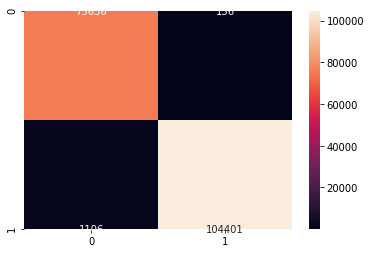
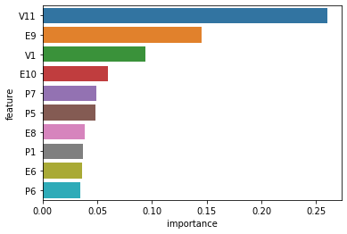

# Driver Alertness Detection Project

## Project Description


The objective of this project is to design a machine learning model that will detect whether the driver is alert or not alert, employing any combination of vehicular, environmental and driver physiological data that are acquired while driving.

The dataset source: https://www.kaggle.com/c/stayalert


```python

```

### Tools


```python
import pandas as pd
import numpy as np
import os
import seaborn as sns
import matplotlib.pyplot as plt
```

### Downloading the dataset


```python

import opendatasets as od
od.downloadurl('https://www.kaggle.com/c/stayalert')
```


```python
### Downloading the dataset
```


```python
train=pd.read_csv("./fordTrain.csv",index_col=1)
train.head()
```


<div>
<style scoped>
    .dataframe tbody tr th:only-of-type {
        vertical-align: middle;
    }

    .dataframe tbody tr th {
        vertical-align: top;
    }

    .dataframe thead th {
        text-align: right;
    }
</style>
<table border="1" class="dataframe">
  <thead>
    <tr style="text-align: right;">
      <th></th>
      <th>TrialID</th>
      <th>IsAlert</th>
      <th>P1</th>
      <th>P2</th>
      <th>P3</th>
      <th>P4</th>
      <th>P5</th>
      <th>P6</th>
      <th>P7</th>
      <th>P8</th>
      <th>...</th>
      <th>V2</th>
      <th>V3</th>
      <th>V4</th>
      <th>V5</th>
      <th>V6</th>
      <th>V7</th>
      <th>V8</th>
      <th>V9</th>
      <th>V10</th>
      <th>V11</th>
    </tr>
    <tr>
      <th>ObsNum</th>
      <th></th>
      <th></th>
      <th></th>
      <th></th>
      <th></th>
      <th></th>
      <th></th>
      <th></th>
      <th></th>
      <th></th>
      <th></th>
      <th></th>
      <th></th>
      <th></th>
      <th></th>
      <th></th>
      <th></th>
      <th></th>
      <th></th>
      <th></th>
      <th></th>
    </tr>
  </thead>
  <tbody>
    <tr>
      <th>0</th>
      <td>0</td>
      <td>0</td>
      <td>34.7406</td>
      <td>9.84593</td>
      <td>1400</td>
      <td>42.8571</td>
      <td>0.290601</td>
      <td>572</td>
      <td>104.895</td>
      <td>0</td>
      <td>...</td>
      <td>0.175</td>
      <td>752</td>
      <td>5.99375</td>
      <td>0</td>
      <td>2005</td>
      <td>0</td>
      <td>13.4</td>
      <td>0</td>
      <td>4</td>
      <td>14.8004</td>
    </tr>
    <tr>
      <th>1</th>
      <td>0</td>
      <td>0</td>
      <td>34.4215</td>
      <td>13.41120</td>
      <td>1400</td>
      <td>42.8571</td>
      <td>0.290601</td>
      <td>572</td>
      <td>104.895</td>
      <td>0</td>
      <td>...</td>
      <td>0.455</td>
      <td>752</td>
      <td>5.99375</td>
      <td>0</td>
      <td>2007</td>
      <td>0</td>
      <td>13.4</td>
      <td>0</td>
      <td>4</td>
      <td>14.7729</td>
    </tr>
    <tr>
      <th>2</th>
      <td>0</td>
      <td>0</td>
      <td>34.3447</td>
      <td>15.18520</td>
      <td>1400</td>
      <td>42.8571</td>
      <td>0.290601</td>
      <td>576</td>
      <td>104.167</td>
      <td>0</td>
      <td>...</td>
      <td>0.280</td>
      <td>752</td>
      <td>5.99375</td>
      <td>0</td>
      <td>2011</td>
      <td>0</td>
      <td>13.4</td>
      <td>0</td>
      <td>4</td>
      <td>14.7736</td>
    </tr>
    <tr>
      <th>3</th>
      <td>0</td>
      <td>0</td>
      <td>34.3421</td>
      <td>8.84696</td>
      <td>1400</td>
      <td>42.8571</td>
      <td>0.290601</td>
      <td>576</td>
      <td>104.167</td>
      <td>0</td>
      <td>...</td>
      <td>0.070</td>
      <td>752</td>
      <td>5.99375</td>
      <td>0</td>
      <td>2015</td>
      <td>0</td>
      <td>13.4</td>
      <td>0</td>
      <td>4</td>
      <td>14.7667</td>
    </tr>
    <tr>
      <th>4</th>
      <td>0</td>
      <td>0</td>
      <td>34.3322</td>
      <td>14.69940</td>
      <td>1400</td>
      <td>42.8571</td>
      <td>0.290601</td>
      <td>576</td>
      <td>104.167</td>
      <td>0</td>
      <td>...</td>
      <td>0.175</td>
      <td>752</td>
      <td>5.99375</td>
      <td>0</td>
      <td>2017</td>
      <td>0</td>
      <td>13.4</td>
      <td>0</td>
      <td>4</td>
      <td>14.7757</td>
    </tr>
  </tbody>
</table>
<p>5 rows × 32 columns</p>
</div>


```python
test=pd.read_csv("./fordTest.csv")
```

#counting missing values

### Exploratory Data Analysis


```python
train.isna().sum()
```


    TrialID    0
    IsAlert    0
    P1         0
    P2         0
    P3         0
    P4         0
    P5         0
    P6         0
    P7         0
    P8         0
    E1         0
    E2         0
    E3         0
    E4         0
    E5         0
    E6         0
    E7         0
    E8         0
    E9         0
    E10        0
    E11        0
    V1         0
    V2         0
    V3         0
    V4         0
    V5         0
    V6         0
    V7         0
    V8         0
    V9         0
    V10        0
    V11        0
    dtype: int64


```python
test.isna().sum()
```


    TrialID    0
    ObsNum     0
    IsAlert    0
    P1         0
    P2         0
    P3         0
    P4         0
    P5         0
    P6         0
    P7         0
    P8         0
    E1         0
    E2         0
    E3         0
    E4         0
    E5         0
    E6         0
    E7         0
    E8         0
    E9         0
    E10        0
    E11        0
    V1         0
    V2         0
    V3         0
    V4         0
    V5         0
    V6         0
    V7         0
    V8         0
    V9         0
    V10        0
    V11        0
    dtype: int64


```python
pd.set_option("display.max_columns",500)
```


```python
train.describe()
```


<div>
<style scoped>
    .dataframe tbody tr th:only-of-type {
        vertical-align: middle;
    }

    .dataframe tbody tr th {
        vertical-align: top;
    }

    .dataframe thead th {
        text-align: right;
    }
</style>
<table border="1" class="dataframe">
  <thead>
    <tr style="text-align: right;">
      <th></th>
      <th>TrialID</th>
      <th>IsAlert</th>
      <th>P1</th>
      <th>P2</th>
      <th>P3</th>
      <th>P4</th>
      <th>P5</th>
      <th>P6</th>
      <th>P7</th>
      <th>P8</th>
      <th>E1</th>
      <th>E2</th>
      <th>E3</th>
      <th>E4</th>
      <th>E5</th>
      <th>E6</th>
      <th>E7</th>
      <th>E8</th>
      <th>E9</th>
      <th>E10</th>
      <th>E11</th>
      <th>V1</th>
      <th>V2</th>
      <th>V3</th>
      <th>V4</th>
      <th>V5</th>
      <th>V6</th>
      <th>V7</th>
      <th>V8</th>
      <th>V9</th>
      <th>V10</th>
      <th>V11</th>
    </tr>
  </thead>
  <tbody>
    <tr>
      <th>count</th>
      <td>604329.000000</td>
      <td>604329.000000</td>
      <td>604329.000000</td>
      <td>604329.000000</td>
      <td>604329.000000</td>
      <td>604329.000000</td>
      <td>604329.000000</td>
      <td>604329.000000</td>
      <td>604329.000000</td>
      <td>604329.0</td>
      <td>604329.000000</td>
      <td>604329.000000</td>
      <td>604329.000000</td>
      <td>604329.000000</td>
      <td>604329.000000</td>
      <td>604329.000000</td>
      <td>604329.000000</td>
      <td>604329.000000</td>
      <td>604329.000000</td>
      <td>604329.000000</td>
      <td>604329.000000</td>
      <td>604329.000000</td>
      <td>604329.000000</td>
      <td>604329.000000</td>
      <td>604329.000000</td>
      <td>604329.000000</td>
      <td>604329.000000</td>
      <td>604329.0</td>
      <td>604329.000000</td>
      <td>604329.0</td>
      <td>604329.000000</td>
      <td>604329.000000</td>
    </tr>
    <tr>
      <th>mean</th>
      <td>250.167657</td>
      <td>0.578799</td>
      <td>35.449020</td>
      <td>11.996525</td>
      <td>1026.671035</td>
      <td>64.061965</td>
      <td>0.178923</td>
      <td>845.384610</td>
      <td>77.887628</td>
      <td>0.0</td>
      <td>10.512332</td>
      <td>102.790045</td>
      <td>0.290565</td>
      <td>-4.230136</td>
      <td>0.016262</td>
      <td>358.674738</td>
      <td>1.757296</td>
      <td>1.383058</td>
      <td>0.876787</td>
      <td>63.311256</td>
      <td>1.315265</td>
      <td>76.965412</td>
      <td>-0.037710</td>
      <td>573.786433</td>
      <td>19.961030</td>
      <td>0.179814</td>
      <td>1715.688383</td>
      <td>0.0</td>
      <td>12.710354</td>
      <td>0.0</td>
      <td>3.312257</td>
      <td>11.668277</td>
    </tr>
    <tr>
      <th>std</th>
      <td>145.446164</td>
      <td>0.493752</td>
      <td>7.484629</td>
      <td>3.760292</td>
      <td>309.277877</td>
      <td>19.755950</td>
      <td>0.372309</td>
      <td>2505.335141</td>
      <td>18.577930</td>
      <td>0.0</td>
      <td>14.049071</td>
      <td>127.258629</td>
      <td>1.006162</td>
      <td>35.508596</td>
      <td>0.002304</td>
      <td>27.399973</td>
      <td>2.854852</td>
      <td>1.608807</td>
      <td>0.328681</td>
      <td>18.891029</td>
      <td>5.247204</td>
      <td>44.387031</td>
      <td>0.403896</td>
      <td>298.412888</td>
      <td>63.269456</td>
      <td>0.384033</td>
      <td>618.176470</td>
      <td>0.0</td>
      <td>11.532085</td>
      <td>0.0</td>
      <td>1.243586</td>
      <td>9.934423</td>
    </tr>
    <tr>
      <th>min</th>
      <td>0.000000</td>
      <td>0.000000</td>
      <td>-22.481200</td>
      <td>-45.629200</td>
      <td>504.000000</td>
      <td>23.885300</td>
      <td>0.038920</td>
      <td>128.000000</td>
      <td>0.262224</td>
      <td>0.0</td>
      <td>0.000000</td>
      <td>0.000000</td>
      <td>0.000000</td>
      <td>-250.000000</td>
      <td>0.008000</td>
      <td>260.000000</td>
      <td>0.000000</td>
      <td>0.000000</td>
      <td>0.000000</td>
      <td>0.000000</td>
      <td>0.000000</td>
      <td>0.000000</td>
      <td>-4.795000</td>
      <td>240.000000</td>
      <td>0.000000</td>
      <td>0.000000</td>
      <td>0.000000</td>
      <td>0.0</td>
      <td>0.000000</td>
      <td>0.0</td>
      <td>1.000000</td>
      <td>1.676730</td>
    </tr>
    <tr>
      <th>25%</th>
      <td>125.000000</td>
      <td>0.000000</td>
      <td>31.758100</td>
      <td>9.903540</td>
      <td>792.000000</td>
      <td>49.180300</td>
      <td>0.092110</td>
      <td>668.000000</td>
      <td>66.666700</td>
      <td>0.0</td>
      <td>0.000000</td>
      <td>0.000000</td>
      <td>0.000000</td>
      <td>-8.000000</td>
      <td>0.015686</td>
      <td>348.000000</td>
      <td>0.000000</td>
      <td>0.000000</td>
      <td>1.000000</td>
      <td>52.000000</td>
      <td>0.000000</td>
      <td>41.930000</td>
      <td>-0.175000</td>
      <td>255.000000</td>
      <td>1.487500</td>
      <td>0.000000</td>
      <td>1259.000000</td>
      <td>0.0</td>
      <td>0.000000</td>
      <td>0.0</td>
      <td>3.000000</td>
      <td>7.947680</td>
    </tr>
    <tr>
      <th>50%</th>
      <td>250.000000</td>
      <td>1.000000</td>
      <td>34.145100</td>
      <td>11.400400</td>
      <td>1000.000000</td>
      <td>60.000000</td>
      <td>0.105083</td>
      <td>800.000000</td>
      <td>75.000000</td>
      <td>0.0</td>
      <td>0.000000</td>
      <td>0.000000</td>
      <td>0.000000</td>
      <td>0.000000</td>
      <td>0.016001</td>
      <td>365.000000</td>
      <td>1.000000</td>
      <td>1.000000</td>
      <td>1.000000</td>
      <td>67.000000</td>
      <td>0.000000</td>
      <td>100.400000</td>
      <td>0.000000</td>
      <td>511.000000</td>
      <td>3.018750</td>
      <td>0.000000</td>
      <td>1994.000000</td>
      <td>0.0</td>
      <td>12.800000</td>
      <td>0.0</td>
      <td>4.000000</td>
      <td>10.772600</td>
    </tr>
    <tr>
      <th>75%</th>
      <td>374.000000</td>
      <td>1.000000</td>
      <td>37.311900</td>
      <td>13.644200</td>
      <td>1220.000000</td>
      <td>75.757600</td>
      <td>0.138814</td>
      <td>900.000000</td>
      <td>89.820400</td>
      <td>0.0</td>
      <td>28.240000</td>
      <td>211.584000</td>
      <td>0.000000</td>
      <td>6.000000</td>
      <td>0.016694</td>
      <td>367.000000</td>
      <td>2.000000</td>
      <td>2.000000</td>
      <td>1.000000</td>
      <td>73.000000</td>
      <td>0.000000</td>
      <td>108.500000</td>
      <td>0.070000</td>
      <td>767.000000</td>
      <td>7.481250</td>
      <td>0.000000</td>
      <td>2146.000000</td>
      <td>0.0</td>
      <td>21.900000</td>
      <td>0.0</td>
      <td>4.000000</td>
      <td>15.270900</td>
    </tr>
    <tr>
      <th>max</th>
      <td>510.000000</td>
      <td>1.000000</td>
      <td>101.351000</td>
      <td>71.173700</td>
      <td>2512.000000</td>
      <td>119.048000</td>
      <td>27.202200</td>
      <td>228812.000000</td>
      <td>468.750000</td>
      <td>0.0</td>
      <td>243.991000</td>
      <td>359.995000</td>
      <td>4.000000</td>
      <td>260.000000</td>
      <td>0.023939</td>
      <td>513.000000</td>
      <td>25.000000</td>
      <td>9.000000</td>
      <td>1.000000</td>
      <td>127.000000</td>
      <td>52.400000</td>
      <td>129.700000</td>
      <td>3.990000</td>
      <td>1023.000000</td>
      <td>484.488000</td>
      <td>1.000000</td>
      <td>4892.000000</td>
      <td>0.0</td>
      <td>82.100000</td>
      <td>0.0</td>
      <td>7.000000</td>
      <td>262.534000</td>
    </tr>
  </tbody>
</table>
</div>


```python
'''
Since V7,V9  and P8 have all values zero, Trial ID not required.
we will drop these variables'''

train=train.drop(columns=["TrialID","V7","V9","P8"])
```


```python
train.info()
#check RAM uses
```

    <class 'pandas.core.frame.DataFrame'>
    Int64Index: 604329 entries, 0 to 1198
    Data columns (total 28 columns):
     #   Column   Non-Null Count   Dtype  
    ---  ------   --------------   -----  
     0   IsAlert  604329 non-null  int64  
     1   P1       604329 non-null  float64
     2   P2       604329 non-null  float64
     3   P3       604329 non-null  int64  
     4   P4       604329 non-null  float64
     5   P5       604329 non-null  float64
     6   P6       604329 non-null  int64  
     7   P7       604329 non-null  float64
     8   E1       604329 non-null  float64
     9   E2       604329 non-null  float64
     10  E3       604329 non-null  int64  
     11  E4       604329 non-null  int64  
     12  E5       604329 non-null  float64
     13  E6       604329 non-null  int64  
     14  E7       604329 non-null  int64  
     15  E8       604329 non-null  int64  
     16  E9       604329 non-null  int64  
     17  E10      604329 non-null  int64  
     18  E11      604329 non-null  float64
     19  V1       604329 non-null  float64
     20  V2       604329 non-null  float64
     21  V3       604329 non-null  int64  
     22  V4       604329 non-null  float64
     23  V5       604329 non-null  int64  
     24  V6       604329 non-null  int64  
     25  V8       604329 non-null  float64
     26  V10      604329 non-null  int64  
     27  V11      604329 non-null  float64
    dtypes: float64(14), int64(14)
    memory usage: 133.7 MB
    


```python
#Reducing RAM uses

x=['P3','P6','E3','E4','E6','E7','E8','E9','E10','V3','V5','V6','V10','IsAlert']
for i in x:
    train[i]=train[i].astype('int16')

y=['P1','P2','P4','P5','P7','E1','E2','E5','E11','V1','V2','V4','V8','V11']
for i in y:
    train[i]=train[i].astype('float16')
```


```python
train.info()
```

    <class 'pandas.core.frame.DataFrame'>
    Int64Index: 604329 entries, 0 to 1198
    Data columns (total 28 columns):
     #   Column   Non-Null Count   Dtype  
    ---  ------   --------------   -----  
     0   IsAlert  604329 non-null  int16  
     1   P1       604329 non-null  float16
     2   P2       604329 non-null  float16
     3   P3       604329 non-null  int16  
     4   P4       604329 non-null  float16
     5   P5       604329 non-null  float16
     6   P6       604329 non-null  int16  
     7   P7       604329 non-null  float16
     8   E1       604329 non-null  float16
     9   E2       604329 non-null  float16
     10  E3       604329 non-null  int16  
     11  E4       604329 non-null  int16  
     12  E5       604329 non-null  float16
     13  E6       604329 non-null  int16  
     14  E7       604329 non-null  int16  
     15  E8       604329 non-null  int16  
     16  E9       604329 non-null  int16  
     17  E10      604329 non-null  int16  
     18  E11      604329 non-null  float16
     19  V1       604329 non-null  float16
     20  V2       604329 non-null  float16
     21  V3       604329 non-null  int16  
     22  V4       604329 non-null  float16
     23  V5       604329 non-null  int16  
     24  V6       604329 non-null  int16  
     25  V8       604329 non-null  float16
     26  V10      604329 non-null  int16  
     27  V11      604329 non-null  float16
    dtypes: float16(14), int16(14)
    memory usage: 36.9 MB
    

### Model Building

## Model 1


```python
#model 1

from sklearn.model_selection import train_test_split

x = train.drop(['IsAlert'], axis='columns')

y=train['IsAlert']

x_train, x_test, y_train, y_test = train_test_split(x, y, test_size=0.3)


from sklearn.linear_model import LogisticRegression
```


```python
#initiate the model

logreg=LogisticRegression()

#fit the model with data

logreg.fit(x_train,y_train)

#predicting y_test

y_pred=logreg.predict(x_test)

#import metrics class

from sklearn import metrics

cnf_matrix=metrics.confusion_matrix(y_test,y_pred)

cnf_matrix

metrics.precision_score(y_test,y_pred)
metrics.recall_score(y_test,y_pred)
```

    c:\users\elsie\appdata\local\programs\python\python37\lib\site-packages\sklearn\linear_model\_logistic.py:765: ConvergenceWarning: lbfgs failed to converge (status=1):
    STOP: TOTAL NO. of ITERATIONS REACHED LIMIT.
    
    Increase the number of iterations (max_iter) or scale the data as shown in:
        https://scikit-learn.org/stable/modules/preprocessing.html
    Please also refer to the documentation for alternative solver options:
        https://scikit-learn.org/stable/modules/linear_model.html#logistic-regression
      extra_warning_msg=_LOGISTIC_SOLVER_CONVERGENCE_MSG)
    


    0.7760551660816588


## Model 2


```python
#randomeforestclassifier

from sklearn.ensemble import RandomForestClassifier

rfc=RandomForestClassifier()
rfc.fit(x_train,y_train)


y_pred=rfc.predict(x_test)


```


```python
cnf_matrix1=metrics.confusion_matrix(y_pred,y_test)
print(y_test.value_counts())
print(cnf_matrix1)
```

    1    104557
    0     76742
    Name: IsAlert, dtype: int64
    [[ 75636    156]
     [  1106 104401]]
    


```python
import seaborn as sns 
sns.heatmap(cnf_matrix1,annot=True,fmt="d")
```


    <matplotlib.axes._subplots.AxesSubplot at 0x27078ed470>





```python
metrics.f1_score(y_test,y_pred)

```


    0.9939923071064056


```python
report=metrics.classification_report(y_test,y_pred)
print(report)
```

                  precision    recall  f1-score   support
    
               0       1.00      0.99      0.99     76742
               1       0.99      1.00      0.99    104557
    
        accuracy                           0.99    181299
       macro avg       0.99      0.99      0.99    181299
    weighted avg       0.99      0.99      0.99    181299
    
    


```python
from sklearn import tree


clf=tree.DecisionTreeClassifier()
clf.fit(x_train,y_train)
y_pred=clf.predict(x_test)
cnf_matrix1=metrics.confusion_matrix(y_pred,y_test)
print(metrics.classification_report(y_test,y_pred))
```

                  precision    recall  f1-score   support
    
               0       0.98      0.98      0.98     76742
               1       0.99      0.99      0.99    104557
    
        accuracy                           0.99    181299
       macro avg       0.98      0.98      0.98    181299
    weighted avg       0.99      0.99      0.99    181299
    
    


```python
solution=pd.read_csv("../input/stayalert/Solution.csv")
```


```python
test=test.drop(columns=["TrialID","V7","V9","P8","IsAlert","ObsNum"])
test.info()
```


```python
test_pred=rfc.predict(test)
```


```python
print(metrics.classification_report(test_pred,solution["Prediction"]))
```

### Feature Importance


```python
clf.feature_importances_
```


    array([0.03672789, 0.00222843, 0.0050812 , 0.00568863, 0.04849003,
           0.03455144, 0.04917552, 0.01104372, 0.02545727, 0.00066079,
           0.01559953, 0.02874216, 0.03633906, 0.02663885, 0.03827437,
           0.14492718, 0.06006936, 0.00254335, 0.09415687, 0.00948958,
           0.00217166, 0.01500121, 0.00456216, 0.02870813, 0.01161435,
           0.00206367, 0.25999358])


```python
importance_df = pd.DataFrame({ 
    'feature': x_train.columns, 
    'importance': clf.feature_importances_
}).sort_values('importance', ascending=False)
importance_df.head(10)
```


<div>
<style scoped>
    .dataframe tbody tr th:only-of-type {
        vertical-align: middle;
    }

    .dataframe tbody tr th {
        vertical-align: top;
    }

    .dataframe thead th {
        text-align: right;
    }
</style>
<table border="1" class="dataframe">
  <thead>
    <tr style="text-align: right;">
      <th></th>
      <th>feature</th>
      <th>importance</th>
    </tr>
  </thead>
  <tbody>
    <tr>
      <th>26</th>
      <td>V11</td>
      <td>0.259994</td>
    </tr>
    <tr>
      <th>15</th>
      <td>E9</td>
      <td>0.144927</td>
    </tr>
    <tr>
      <th>18</th>
      <td>V1</td>
      <td>0.094157</td>
    </tr>
    <tr>
      <th>16</th>
      <td>E10</td>
      <td>0.060069</td>
    </tr>
    <tr>
      <th>6</th>
      <td>P7</td>
      <td>0.049176</td>
    </tr>
    <tr>
      <th>4</th>
      <td>P5</td>
      <td>0.048490</td>
    </tr>
    <tr>
      <th>14</th>
      <td>E8</td>
      <td>0.038274</td>
    </tr>
    <tr>
      <th>0</th>
      <td>P1</td>
      <td>0.036728</td>
    </tr>
    <tr>
      <th>12</th>
      <td>E6</td>
      <td>0.036339</td>
    </tr>
    <tr>
      <th>5</th>
      <td>P6</td>
      <td>0.034551</td>
    </tr>
  </tbody>
</table>
</div>


```python
sns.barplot(data=importance_df.head(10), x='importance', y='feature');
```





```python
import jovian
```


```python
jovian.commit()
```


    <IPython.core.display.Javascript object>


    [jovian] Committed successfully! https://jovian.ai/vincent-kizza/driver-alertness


    'https://jovian.ai/vincent-kizza/driver-alertness'


```python

```
